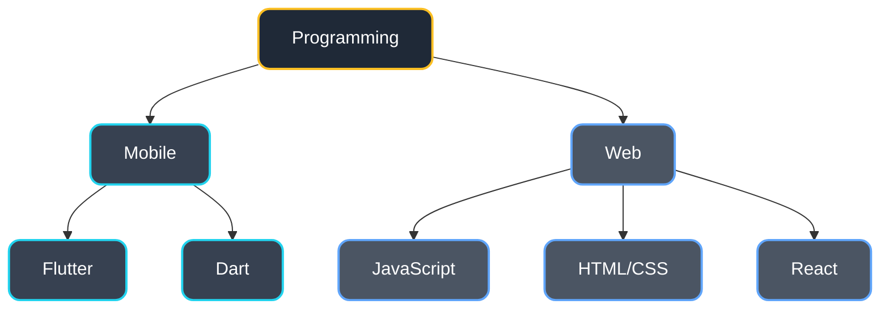
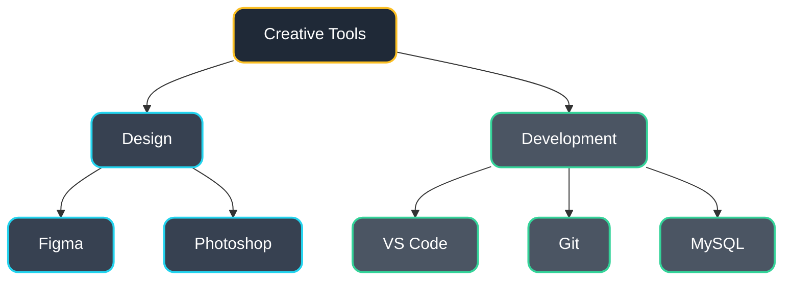

<h1 align="center">Hi, I'm Muhammed Raseel 👋</h1>
<h3 align="center">Flutter Enthusiast</h3>

<div align="center">


[](https://www.linkedin.com/in/connectmeraseel/)
[](mailto:raseelp321@gmail.com)
[]()


</div>

```typescript
class Developer {
    name: string = "Muhammed Raseel";
    role: string = "Flutter Developer";
    location: string = "India,Kerala";
    workingOn: string = "Flip N Pair";
    learning: string[] = ["Flutter", "React", "Python"];
    askMeAbout: string[] = ["Web Dev", "App Dev", "Flutter", "UI/UX"];
}
```

## 💻 Technical Skills



## 🎨 Design & Tools



<div align="left">
  <h3>:hammer_and_wrench: Languages & tools i like to use</h3>
</div>

<p align="left">
  ⠀⠀⠀
</p>


## 📊 GitHub Stats

<div align="center">
  
  &nbsp;&nbsp;
  
</div>

## 🤝 Connect With Me

<div align="center">
    
[](https://www.linkedin.com/in/connectmeraseel/)
[](https://www.instagram.com/rra_see_ll/?__pwa=1)
[](https://www.hackerrank.com/raseelp321)
[](https://leetcode.com/u/MuhammedRaseel/)


</div>


<div align="center">
  <i>Always learning, always growing. Feel free to reach out!</i>
</div>
