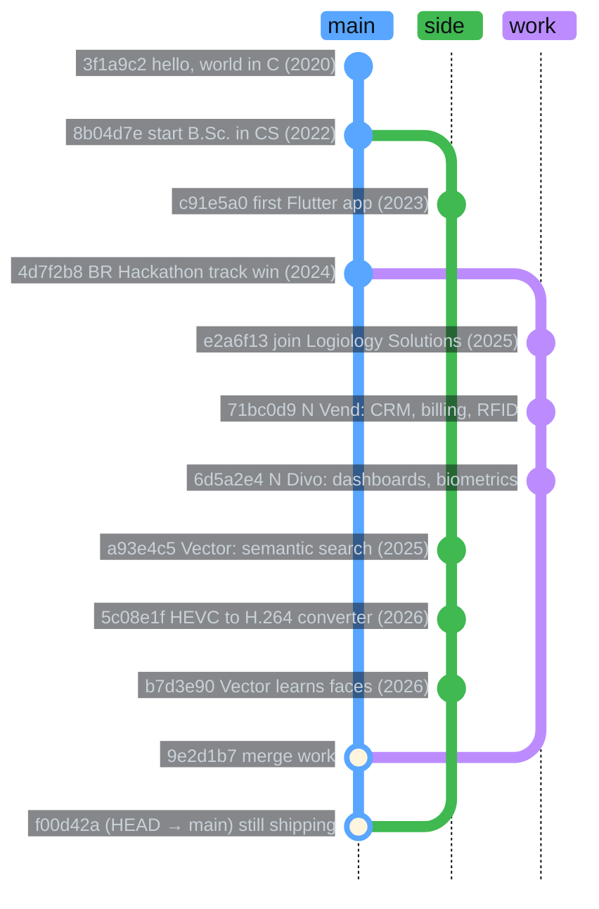
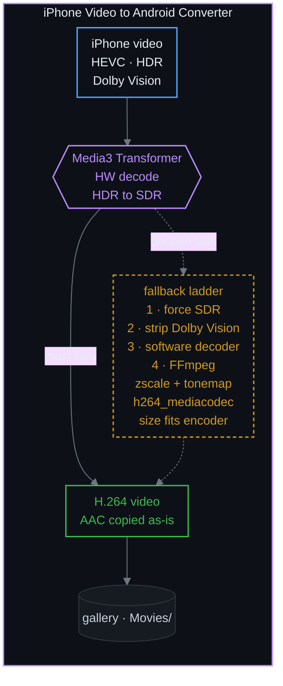

<h1 align="center">Muhammed Raseel</h1>

<p align="center">
  Flutter developer at Logiology Solutions, Calicut.<br/>
  Cross-platform apps by day, the Kotlin underneath them by night.
</p>

<p align="center">
  <code>raseel@kerala:~$ ls</code>
  <br/><br/>
  <a href="https://raseelportfolio.vercel.app"><code>portfolio/</code></a>
  &nbsp;&nbsp;
  <a href="https://www.linkedin.com/in/connectmeraseel/"><code>linkedin/</code></a>
  &nbsp;&nbsp;
  <a href="https://raseelportfolio.vercel.app/resume.pdf"><code>resume.pdf</code></a>
  &nbsp;&nbsp;
  <a href="mailto:raseelp321@gmail.com"><code>say-hello.eml</code></a>
</p>

<br/>

```dart
class Raseel extends Developer {
  final role = 'Flutter Developer';
  final at = 'Logiology Solutions';
  final city = 'Calicut, Kerala';

  final langs = [
    'Dart', 'Kotlin', 'Go', 'C',
  ];
  final ships = [
    'Play Store', 'App Store',
  ];
  final enjoys = [
    'platform channels',
    'on-device ML',
    'Android internals',
  ];

  @override
  String get motto =>
    'There is no magic. Just '
    'another layer of abstraction.';
}
```

<br/>

## `git log --graph --all`


```mermaid
%%{init: {'theme': 'base', 'themeCSS': '.branch {stroke-width:2px !important;} .commit {r:5px;} .arrow {stroke-width:2px !important;} .commit-highlight-outer, .commit-highlight-inner {r:5px;}', 'themeVariables': {'git0': '#58A6FF', 'git1': '#3FB950', 'git2': '#BC8CFF', 'gitBranchLabel0': '#0D1117', 'gitBranchLabel1': '#0D1117', 'gitBranchLabel2': '#0D1117', 'commitLabelColor': '#C9D1D9', 'commitLabelBackground': '#0D1117', 'commitLabelFontSize': '13px', 'fontFamily': 'monospace'}, 'gitGraph': {'mainBranchName': 'main', 'rotateCommitLabel': false}}}%%
gitGraph TB:
  commit id: "3f1a9c2 hello, world in C (2020)"
  commit id: "8b04d7e start B.Sc. in CS (2022)"
  branch side
  commit id: "c91e5a0 first Flutter app (2023)"
  checkout main
  commit id: "4d7f2b8 BR Hackathon track win (2024)"
  branch work
  commit id: "e2a6f13 join Logiology Solutions (2025)"
  commit id: "71bc0d9 N Vend: CRM, billing, RFID"
  commit id: "6d5a2e4 N Divo: dashboards, biometrics"
  checkout side
  commit id: "a93e4c5 Vector: semantic search (2025)"
  commit id: "5c08e1f HEVC to H.264 converter (2026)"
  commit id: "b7d3e90 Vector learns faces (2026)"
  checkout main
  merge work id: "9e2d1b7 merge work"
  merge side id: "f00d42a (HEAD → main) still shipping"
```

<br/>

## Selected work


```mermaid
%%{init: {'theme': 'base', 'themeCSS': '.flowchart-link {stroke-width:1.5px !important;} .cluster rect {rx:10px; ry:10px;} .edgeLabel, .edgeLabel p, .edgeLabel span {background-color:#0D1117 !important; color:#8B949E !important;} .edgeLabel rect {fill:#0D1117 !important;}', 'themeVariables': {'fontSize': '14px', 'fontFamily': 'monospace', 'lineColor': '#6E7681', 'primaryTextColor': '#E6EDF3'}, 'flowchart': {'nodeSpacing': 18, 'rankSpacing': 30, 'padding': 8, 'diagramPadding': 4}}}%%
flowchart TB
  subgraph VEC["Vector"]
    direction TB

    subgraph FL["Flutter · Dart"]
      direction TB
      UI["Search · Library · Faces<br/>photo + video viewers<br/>tappable faces<br/>collections<br/>merge · split · review"]
      CTRL["GetX controllers<br/>Native · Faces<br/>Collections<br/>sqflite folder DB"]
      TOK["CLIP BPE tokenizer<br/>query to 77 ids"]
      SVC{{"NativeServices<br/>1 MethodChannel<br/>3 EventChannels"}}
      UI <--> CTRL
      CTRL --> TOK
      CTRL <--> SVC
    end

    subgraph KT["Kotlin · Android"]
      direction TB
      SRC["MediaStore / SAF<br/>photos + videos"]

      subgraph IDX["index · fg service"]
        direction TB
        FRM["photos as-is<br/>videos: 3-10 frames"] --> PRE["224 × 224 crop<br/>CLIP normalise"]
        PRE --> VIS["CLIP vision<br/>PyTorch Mobile"]
        VIS --> BIN[("embeddings.bin<br/>512-d, L2 norm")]
      end

      subgraph SRCH["search"]
        direction TB
        TXT["CLIP text<br/>PyTorch Mobile"] --> DOT{{"dot product<br/>= cosine"}}
      end

      subgraph PPL["people · WorkManager"]
        direction TB
        DET["SCRFD detect<br/>ONNX · 640 px"] --> QG["quality gate<br/>size · yaw · blur"]
        QG --> ALN["5-point align<br/>112 × 112"]
        ALN --> ARC["ArcFace r50<br/>512-d vector"]
        ARC --> CLU{{"incremental<br/>clustering"}}
        CLU --> FDB[("SQLite<br/>people, faces")]
      end

      SRC --> FRM
      SRC --> DET
      BIN --> DOT
      BIN ~~~ TXT
    end

    FL ==>|"MethodChannel"| KT
    KT ==>|"EventChannels"| FL
  end

  classDef in fill:#0D1117,stroke:#58A6FF,stroke-width:1.5px,color:#E6EDF3
  classDef model fill:#161B22,stroke:#30363D,stroke-width:1px,color:#C9D1D9
  classDef core fill:#0D1117,stroke:#BC8CFF,stroke-width:1.5px,color:#BC8CFF
  classDef warn fill:#0D1117,stroke:#D29922,stroke-width:1.5px,stroke-dasharray:4 3,color:#D29922
  classDef hit fill:#0D1117,stroke:#3FB950,stroke-width:1.5px,color:#3FB950
  class SRC in
  class UI,CTRL,TOK,FDBD,FRM,PRE,VIS,TXT,DET,QG,ALN,ARC,BIN,FDB model
  class SVC core
  class DOT hit
  class CLU core
  style VEC fill:#0D1117,stroke:#58A6FF,stroke-width:1.5px,color:#E6EDF3
  style FL fill:#0D1117,stroke:#58A6FF,stroke-dasharray:4 4,color:#58A6FF
  style KT fill:#0D1117,stroke:#BC8CFF,stroke-dasharray:4 4,color:#BC8CFF
  style IDX fill:#161B22,stroke:#30363D,color:#8B949E
  style SRCH fill:#161B22,stroke:#30363D,color:#8B949E
  style PPL fill:#161B22,stroke:#30363D,color:#8B949E
```

Describe what you're looking for, or hand it a photo, and it finds the match in your gallery no matter what the file is called.
It also recognises the people in your photos and videos and groups them, so you can search by who is in a picture
and jump straight to the moment someone appears in a video. Indexing, search and face recognition all run on the phone.
<br/>
<sub><code>Flutter</code> <code>Kotlin</code> <code>CLIP</code> <code>PyTorch&nbsp;Mobile</code> <code>ONNX&nbsp;Runtime</code> <code>SCRFD</code> <code>ArcFace</code> <code>SQLite</code> <code>WorkManager</code></sub>
&nbsp;&nbsp;[**View repo**](https://github.com/Raseelp/Vector-LocalSemanticSearch)

<br/>


```mermaid
%%{init: {'theme': 'base', 'themeCSS': '.flowchart-link {stroke-width:1.5px !important;} .cluster rect {rx:10px; ry:10px;} .edgeLabel, .edgeLabel p, .edgeLabel span {background-color:#0D1117 !important; color:#8B949E !important;} .edgeLabel rect {fill:#0D1117 !important;}', 'themeVariables': {'fontSize': '14px', 'fontFamily': 'monospace', 'lineColor': '#6E7681', 'primaryTextColor': '#E6EDF3'}, 'flowchart': {'nodeSpacing': 18, 'rankSpacing': 30, 'padding': 8, 'diagramPadding': 4}}}%%
flowchart TB
  subgraph CONV["iPhone Video to Android Converter"]
    direction TB
    IN["iPhone video<br/>HEVC · HDR<br/>Dolby Vision"] --> TR{{"Media3 Transformer<br/>HW decode<br/>HDR to SDR"}}
    TR -->|most files| OUT["H.264 video<br/>AAC copied as-is"]
    TR -.->|decode fails| LAD["fallback ladder<br/>1 · force SDR<br/>2 · strip Dolby Vision<br/>3 · software decoder<br/>4 · FFmpeg<br/>zscale + tonemap<br/>h264_mediacodec<br/>size fits encoder"]
    LAD -.-> OUT
    OUT --> MS[("gallery · Movies/")]
  end
  classDef in fill:#0D1117,stroke:#58A6FF,stroke-width:1.5px,color:#E6EDF3
  classDef model fill:#161B22,stroke:#30363D,stroke-width:1px,color:#C9D1D9
  classDef core fill:#0D1117,stroke:#BC8CFF,stroke-width:1.5px,color:#BC8CFF
  classDef warn fill:#0D1117,stroke:#D29922,stroke-width:1.5px,stroke-dasharray:4 3,color:#D29922
  classDef hit fill:#0D1117,stroke:#3FB950,stroke-width:1.5px,color:#3FB950
  class IN in
  class MS model
  class TR core
  class LAD warn
  class OUT hit
  style CONV fill:#0D1117,stroke:#BC8CFF,stroke-width:1.5px,color:#E6EDF3
```

iPhones record in HEVC, which a lot of Android phones can't decode, so the video arrives as a black screen.
This app re-encodes it to H.264 in a background service, tone-maps HDR so nothing comes out washed out, and copies the audio untouched.
When a Dolby Vision file defeats every Android decoder, it works down a fallback ladder that ends in a custom FFmpeg chain,
and it checks what the phone's encoder can really produce before choosing the output size.
<br/>
<sub><code>Kotlin</code> <code>Jetpack&nbsp;Compose</code> <code>Media3</code> <code>FFmpeg</code> <code>MediaCodec</code> <code>Foreground service</code> <code>MediaStore</code></sub>
&nbsp;&nbsp;[**View repo**](https://github.com/Raseelp/iPhone-Video-to-Android-Converter)

<br/>

## Stack

<table>
  <tr>
    <td width="50%" valign="top">
      <sub><b>MOBILE</b></sub><br/><br/>
      
      <br/><br/>
      <sub><code>GetX</code> <code>Provider</code> <code>Jetpack&nbsp;Compose</code> <code>Media3</code> <code>MethodChannels</code> <code>EventChannels</code></sub>
    </td>
    <td width="50%" valign="top">
      <sub><b>ON-DEVICE ML</b></sub><br/><br/>
      
      <br/><br/>
      <sub><code>PyTorch&nbsp;Mobile</code> <code>ONNX&nbsp;Runtime</code> <code>CLIP</code> <code>SCRFD</code> <code>ArcFace</code></sub>
    </td>
  </tr>
  <tr>
    <td width="50%" valign="top">
      <sub><b>BACKEND</b></sub><br/><br/>
      
      <br/><br/>
      <sub><code>Gin</code> <code>REST</code> <code>.NET</code></sub>
    </td>
    <td width="50%" valign="top">
      <sub><b>FIREBASE</b></sub><br/><br/>
      
      <br/><br/>
      <sub><code>Crashlytics</code> <code>Perf&nbsp;Monitoring</code> <code>App&nbsp;Check</code> <code>FCM</code></sub>
    </td>
  </tr>
  <tr>
    <td width="50%" valign="top">
      <sub><b>DATA</b></sub><br/><br/>
      
    </td>
    <td width="50%" valign="top">
      <sub><b>TOOLS</b></sub><br/><br/>
      
      <br/><br/>
      <sub><code>FFmpeg</code> <code>Play&nbsp;Console</code> <code>App&nbsp;Store&nbsp;Connect</code></sub>
    </td>
  </tr>
</table>

<br/>

<p align="center">
  <sub>
    Open to interesting problems and good conversations. The fastest way to reach me is
    <a href="mailto:raseelp321@gmail.com">email</a>.
  </sub>
</p>
