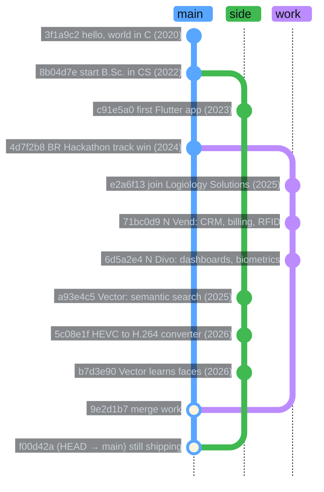

<h1 align="center">Muhammed Raseel</h1>

<p align="center">
  Flutter developer at Logiology Solutions, Calicut.<br/>
 Mobile developer working with Flutter, Kotlin, GetX, REST APIs and Firebase in production. I've shipped to both app stores, worked against .NET backends, and build backends of my own in Go and MongoDB. I build side projects that run ML models entirely on the phone.
</p>

<p align="center">
  <br/><br/>
  <a href="https://raseelportfolio.vercel.app"><code>portfolio/</code></a>
  &nbsp;&nbsp;
  <a href="https://www.linkedin.com/in/connectmeraseel/"><code>linkedin/</code></a>
  &nbsp;&nbsp;
  <a href="https://raseelportfolio.vercel.app/resume.pdf"><code>resume.pdf</code></a>
  &nbsp;&nbsp;
  <a href="mailto:raseelp321@gmail.com"><code>say-hello.eml</code></a>
</p>

<br/>

```dart
class Raseel extends Developer {
  final role = 'Flutter Developer';
  final at = 'Logiology Solutions';
  final city = 'Calicut, Kerala';

  final langs = [
    'Dart', 'Kotlin', 'Go', 'C',
  ];

  final enjoys = [
    'platform channels',
    'on-device ML',
    'Android internals',
  ];

  @override
  String get motto =>
    'There is no magic. Just '
    'another layer of abstraction.';
}
```

<br/>

## `git log --graph --all`


```mermaid
%%{init: {'theme': 'base', 'themeCSS': '.branch {stroke-width:2px !important;} .commit {r:5px;} .arrow {stroke-width:2px !important;} .commit-highlight-outer, .commit-highlight-inner {r:5px;}', 'themeVariables': {'git0': '#58A6FF', 'git1': '#3FB950', 'git2': '#BC8CFF', 'gitBranchLabel0': '#0D1117', 'gitBranchLabel1': '#0D1117', 'gitBranchLabel2': '#0D1117', 'commitLabelColor': '#C9D1D9', 'commitLabelBackground': '#0D1117', 'commitLabelFontSize': '13px', 'fontFamily': 'monospace'}, 'gitGraph': {'mainBranchName': 'main', 'rotateCommitLabel': false}}}%%
gitGraph TB:
  commit id: "3f1a9c2 hello, world in C (2020)"
  commit id: "8b04d7e start B.Sc. in CS (2022)"
  branch side
  commit id: "c91e5a0 first Flutter app (2023)"
  checkout main
  commit id: "4d7f2b8 BR Hackathon track win (2024)"
  branch work
  commit id: "e2a6f13 join Logiology Solutions (2025)"
  commit id: "71bc0d9 N Vend: CRM, billing, RFID"
  commit id: "6d5a2e4 N Divo: dashboards, biometrics"
  checkout side
  commit id: "a93e4c5 Vector: semantic search (2025)"
  commit id: "5c08e1f HEVC to H.264 converter (2026)"
  commit id: "b7d3e90 Vector learns faces (2026)"
  checkout main
  merge work id: "9e2d1b7 merge work"
  merge side id: "f00d42a (HEAD → main) still shipping"
```

<br/>

## Selected work

<table>
  <tr>
    <td>
      <h3>Vector</h3>
      <sub>ON-DEVICE SEMANTIC SEARCH AND FACE RECOGNITION &nbsp;·&nbsp; FLUTTER + KOTLIN</sub>
    </td>
  </tr>
  <tr>
    <td>
      <sub><b>THE ITCH</b></sub>
      <p><i>Finding a photo by what is in it meant scrolling forever, or uploading your whole library to someone's cloud.</i></p>
    </td>
  </tr>
  <tr>
    <td>
      <sub><b>THE BUILD</b></sub>
      <ul>
        <li>Type <b>"a dog on a beach"</b> or hand it a photo, and it finds the match</li>
        <li>Recognises the <b>people</b> across your photos and videos and groups them</li>
        <li>Opens a video <b>right at the moment</b> someone appears</li>
        <li>Runs <b>entirely on the phone</b>: CLIP, SCRFD and ArcFace, no server</li>
      </ul>
    </td>
  </tr>
  <tr>
    <td>
      <sub><b>THE TWIST</b></sub>
      <p>Running face recognition on every frame of a video would take forever. So faces are <b>tracked across frames</b>, and only the best one or two in each track are recognised. A whole clip costs a handful of runs, not hundreds.</p>
    </td>
  </tr>
  <tr>
    <td>
      <sub><code>Flutter</code> <code>Kotlin</code> <code>CLIP</code> <code>PyTorch&nbsp;Mobile</code> <code>ONNX&nbsp;Runtime</code> <code>SQLite</code></sub>
      &nbsp;&nbsp;<a href="https://github.com/Raseelp/Vector-LocalSemanticSearch"><b>View repo →</b></a>
    </td>
  </tr>
</table>

<br/>

<table>
  <tr>
    <td>
      <h3>iPhone Video to Android Converter</h3>
      <sub>HEVC TO H.264 VIDEO CONVERSION &nbsp;·&nbsp; KOTLIN</sub>
    </td>
  </tr>
  <tr>
    <td>
      <sub><b>THE ITCH</b></sub>
      <p><i>iPhones record in HEVC, and a lot of Android phones can't play it. The video arrives as a black screen.</i></p>
    </td>
  </tr>
  <tr>
    <td>
      <sub><b>THE BUILD</b></sub>
      <ul>
        <li><b>One tap</b> re-encodes it to H.264, in the background</li>
        <li><b>HDR is tone-mapped</b> to SDR, so colours don't come out washed out</li>
        <li>Audio is <b>copied untouched</b>, and the result lands in the gallery</li>
      </ul>
    </td>
  </tr>
  <tr>
    <td>
      <sub><b>THE TWIST</b></sub>
      <p>Real Dolby Vision footage failed on <b>every decoder Android has</b>, hardware and software. Four fallbacks later, a custom FFmpeg chain got through. Some phones can play 4K but can't write it, so the app also fits the output to what each phone's encoder <b>can actually produce</b>.</p>
    </td>
  </tr>
  <tr>
    <td>
      <sub><code>Kotlin</code> <code>Jetpack&nbsp;Compose</code> <code>Media3</code> <code>FFmpeg</code> <code>MediaCodec</code></sub>
      &nbsp;&nbsp;<a href="https://github.com/Raseelp/iPhone-Video-to-Android-Converter"><b>View repo →</b></a>
    </td>
  </tr>
</table>

<br/>

## Stack

<table>
  <tr>
    <td width="50%" valign="top">
      <sub><b>MOBILE</b></sub><br/><br/>
      
      <br/><br/>
      <sub><code>GetX</code> <code>Provider</code> <code>Jetpack&nbsp;Compose</code> <code>Media3</code> <code>MethodChannels</code> <code>EventChannels</code></sub>
    </td>
    <td width="50%" valign="top">
      <sub><b>ON-DEVICE ML</b></sub><br/><br/>
      
      <br/><br/>
      <sub><code>PyTorch&nbsp;Mobile</code> <code>ONNX&nbsp;Runtime</code> <code>CLIP</code> <code>SCRFD</code> <code>ArcFace</code></sub>
    </td>
  </tr>
  <tr>
    <td width="50%" valign="top">
      <sub><b>BACKEND</b></sub><br/><br/>
      
      <br/><br/>
      <sub><code>Gin</code> <code>REST</code> <code>.NET</code></sub>
    </td>
    <td width="50%" valign="top">
      <sub><b>FIREBASE</b></sub><br/><br/>
      
      <br/><br/>
      <sub><code>Crashlytics</code> <code>Perf&nbsp;Monitoring</code> <code>App&nbsp;Check</code> <code>FCM</code></sub>
    </td>
  </tr>
  <tr>
    <td width="50%" valign="top">
      <sub><b>DATA</b></sub><br/><br/>
      
    </td>
    <td width="50%" valign="top">
      <sub><b>TOOLS</b></sub><br/><br/>
      
      <br/><br/>
      <sub><code>FFmpeg</code> <code>Play&nbsp;Console</code> <code>App&nbsp;Store&nbsp;Connect</code></sub>
    </td>
  </tr>
</table>

<br/>

<p align="center">
  <sub>
    Open to interesting problems and good conversations. The fastest way to reach me is
    <a href="mailto:raseelp321@gmail.com">email</a>.
  </sub>
</p>
